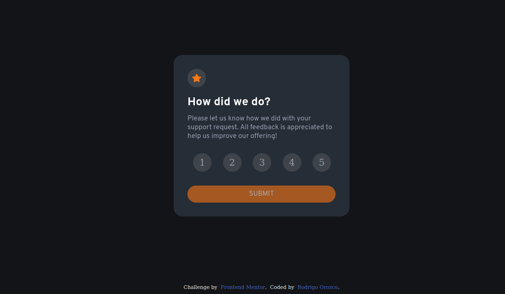

# Frontend Mentor - Interactive rating component solution

This is a solution to the [Interactive rating component challenge on Frontend Mentor](https://www.frontendmentor.io/challenges/interactive-rating-component-koxpeBUmI). Frontend Mentor challenges help you improve your coding skills by building realistic projects.

## Table of contents

- [Overview](#overview)
  - [The challenge](#the-challenge)
  - [Screenshot](#screenshot)
  - [Links](#links)
- [My process](#my-process)
  - [Built with](#built-with)
  - [What I learned](#what-i-learned)
  - [Continued development](#continued-development)
  - [Useful resources](#useful-resources)
- [Author](#author)
- [Acknowledgments](#acknowledgments)

## Overview

### The challenge

Users should be able to:

- View the optimal layout for the app depending on their device's screen size
- See hover states for all interactive elements on the page
- Select and submit a number rating
- See the "Thank you" card state after submitting a rating

### Screenshot




### Links

- Solution URL: [solution code](https://github.com/RodriOrozco/Interactive-Rating-Component-FRONTENDMENTOR)
- Live Site URL: [live site URL here](https://interactive-rating-component-frontendmentor-nine.vercel.app/)

## My process

### Built with

- Sass
- Flexbox
- Javascript
- Semantic HTML5 markup
- Desktop-first workflow
- [React](https://reactjs.org/) - JS library

### What I learned

I learned to be able to manage the information between parent and child components with local states and render them with a ternary script

```html
<button
  type="submit"
  disabled="{!numbersRadio ? true : false}"
  className="form-container__btn-submit"
>
  Submit
</button>
```

```css
.numbers input[type="radio"]:checked + .numbers__label {
  color: $color-neutral-white;
  background-color: $color-neutral-grey;
}
```

## Author

- Website - [Rodrigo Orozco](https://rodrigo-orozco-front-end.vercel.app/)
- Frontend Mentor - [@RodriOrozco](https://www.frontendmentor.io/profile/@RodriOrozco)
- Twitter - [@RodriOrozco2](https://www.twitter.com/@RodriOrozco2)
